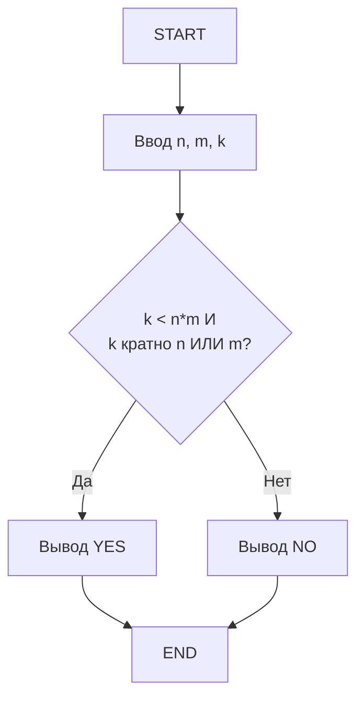
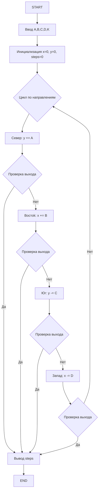
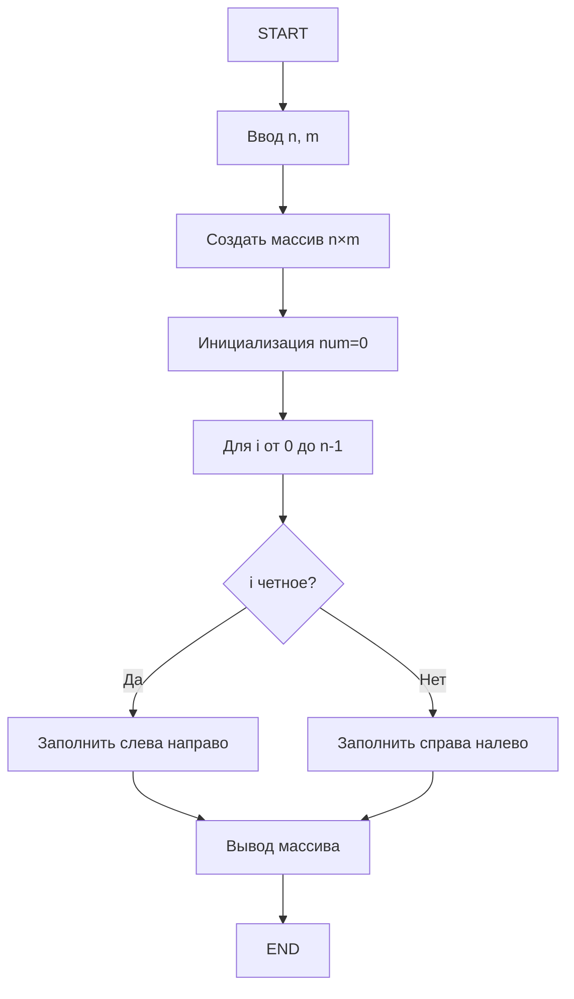
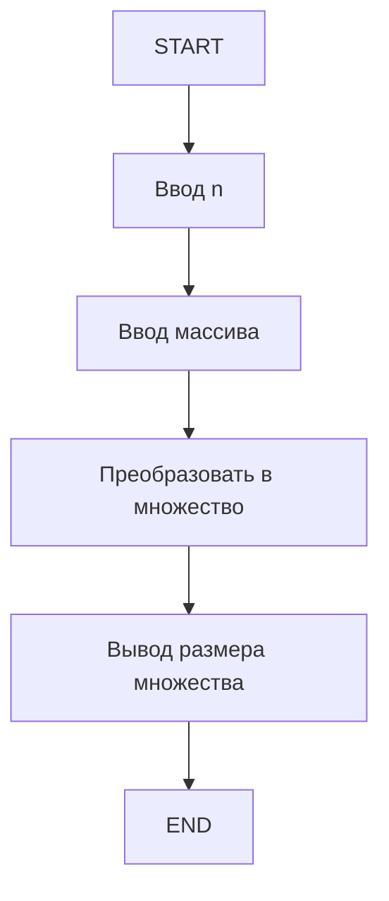
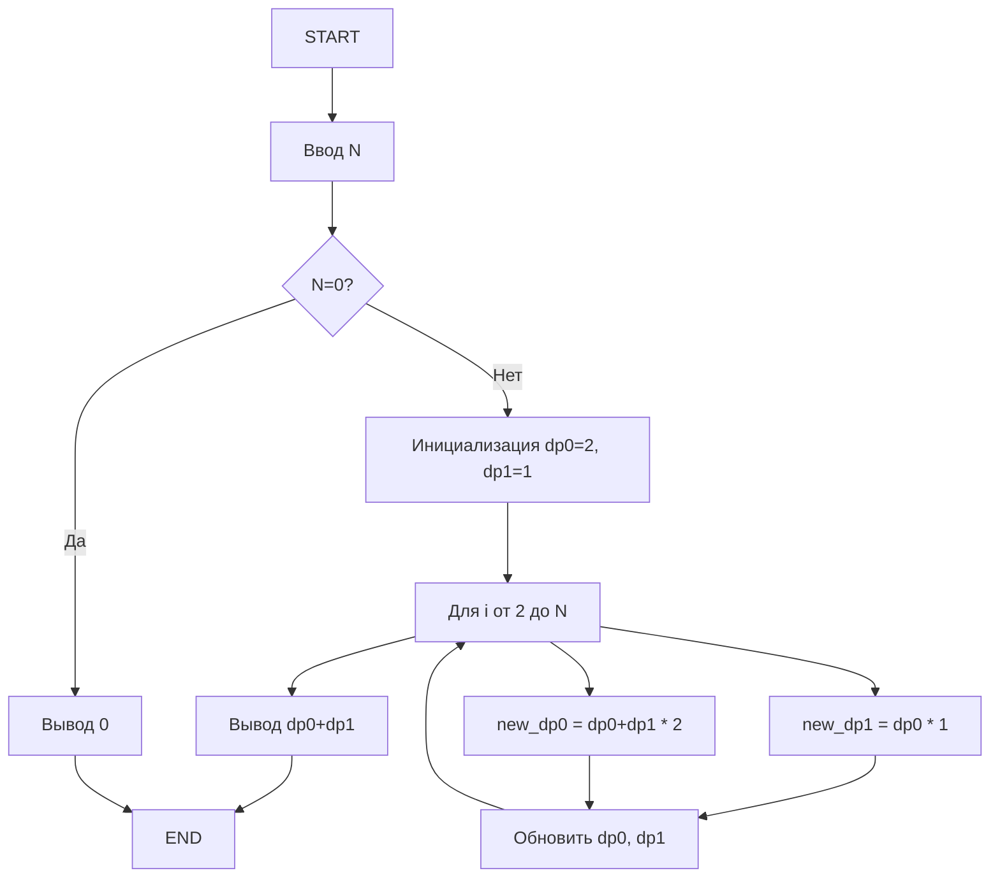
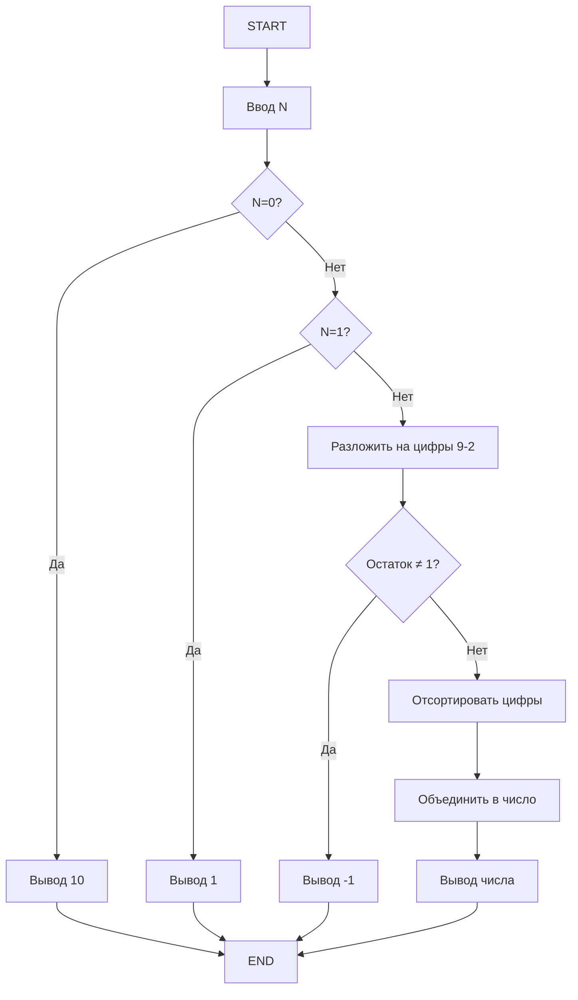
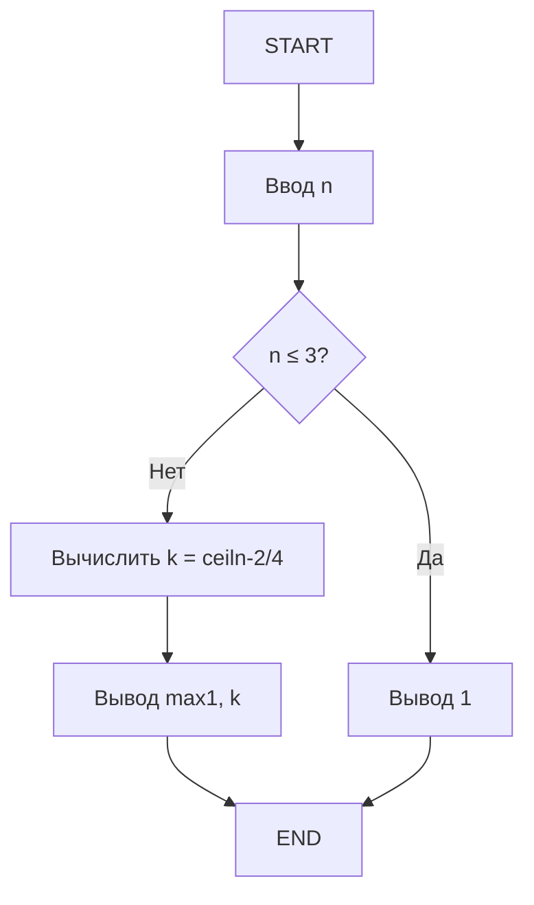

# D. Шоколадка

## Условие
Требуется определить, можно ли от шоколадки размером n × m долек отломить k долек, если разрешается сделать один разлом по прямой между дольками.

## Таблица спецификаций
| Параметр | Тип | Диапазон | Описание |
|----------|-----|----------|----------|
| n, m | int | ≤ 40000 | размеры шоколадки |
| k | int | ≠ n×m | количество отламываемых долек |

## Алгоритм


## Код
```python
def main():
    n, m, k = map(int, input().split())
    if k < n * m and (k % n == 0 or k % m == 0):
        print("YES")
    else:
        print("NO")

if __name__ == "__main__":
    main()
```

## Тесты
| Ввод | Ожидаемый вывод | Пояснение |
|------|-----------------|-----------|
| 3 5 10 | YES | 10 кратно 5 |
| 3 5 11 | NO | 11 не кратно ни 3, ни 5 |
| 2 2 3 | NO | 3 = 2×2 - 1, но нельзя отломить |

# D. Лес

## Условие
Миша проходит циклически A шагов на север, B на восток, C на юг, D на запад. Определить количество шагов до выхода из квадрата со стороной 2K.

## Таблица спецификаций
| Параметр | Тип | Диапазон | Описание |
|----------|-----|----------|----------|
| A,B,C,D | int | ≤ 10⁹ | шаги по направлениям |
| K | int | ≤ 10⁹ | половина стороны квадрата |

## Алгоритм


## Код
```python
def main():
    A = int(input())
    B = int(input())
    C = int(input())
    D = int(input())
    K = int(input())
    
    x, y = 0, 0
    steps = 0
    
    while True:
        # Север
        for _ in range(A):
            y += 1
            steps += 1
            if abs(y) == K or abs(x) == K:
                print(steps)
                return
        
        # Восток
        for _ in range(B):
            x += 1
            steps += 1
            if abs(y) == K or abs(x) == K:
                print(steps)
                return
        
        # Юг
        for _ in range(C):
            y -= 1
            steps += 1
            if abs(y) == K or abs(x) == K:
                print(steps)
                return
        
        # Запад
        for _ in range(D):
            x -= 1
            steps += 1
            if abs(y) == K or abs(x) == K:
                print(steps)
                return

if __name__ == "__main__":
    main()
```

## Тесты
| Ввод | Ожидаемый вывод | Пояснение |
|------|-----------------|-----------|
| 1<br>1<br>2<br>3<br>3 | 13 | Из условия задачи |

# E. Заполнение змейкой

## Условие
Создать массив n×m и заполнить его змейкой.

## Таблица спецификаций
| Параметр | Тип | Диапазон | Описание |
|----------|-----|----------|----------|
| n, m | int | 1-1000 | размеры массива |

## Алгоритм


## Код
```python
def main():
    n, m = map(int, input().split())
    arr = [[0] * m for _ in range(n)]
    
    num = 0
    for i in range(n):
        if i % 2 == 0:
            for j in range(m):
                arr[i][j] = num
                num += 1
        else:
            for j in range(m-1, -1, -1):
                arr[i][j] = num
                num += 1
    
    for row in arr:
        print(' '.join(map(str, row)))

if __name__ == "__main__":
    main()
```

## Тесты
| Ввод | Ожидаемый вывод |
|------|-----------------|
| 3 3 | 0 1 2<br>5 4 3<br>6 7 8 |
| 2 5 | 0 1 2 3 4<br>9 8 7 6 5 |

# F. Мы с тобой разные

## Условие
Определить количество различных элементов в массиве.

## Таблица спецификаций
| Параметр | Тип | Диапазон | Описание |
|----------|-----|----------|----------|
| n | int | 1-10⁵ | размер массива |
| arr | int[] | ±2×10⁹ | элементы массива |

## Алгоритм


## Код
```python
def main():
    n = int(input())
    arr = list(map(int, input().split()))
    distinct = len(set(arr))
    print(distinct)

if __name__ == "__main__":
    main()
```

## Тесты
| Ввод | Ожидаемый вывод |
|------|-----------------|
| 5<br>1 0 1 2 0 | 3 |
| 5<br>1 5 2 3 4 | 5 |

# D. Специалист по волшебному зельеварению

## Условие
Для N ингредиентов определить количество безопасных комбинаций (без двух подряд типа A).

## Таблица спецификаций
| Параметр | Тип | Диапазон | Описание |
|----------|-----|----------|----------|
| N | int | 1-20 | количество ингредиентов |

## Алгоритм


## Код
```python
def main():
    n = int(input())
    if n == 0:
        print(0)
        return
    
    # dp0 - оканчивается на не-A, dp1 - оканчивается на A
    dp0, dp1 = 2, 1
    
    for i in range(2, n+1):
        new_dp0 = (dp0 + dp1) * 2  # Добавляем B или C
        new_dp1 = dp0  # Добавляем только A после не-A
        dp0, dp1 = new_dp0, new_dp1
    
    print(dp0 + dp1)

if __name__ == "__main__":
    main()
```

## Тесты
| Ввод | Ожидаемый вывод | Пояснение |
|------|-----------------|-----------|
| 1 | 3 | A, B, C |
| 2 | 8 | Все комбинации кроме AA |
| 3 | 22 | 3^3 - 5 опасных |

# В. Престижный номер

## Условие
Найти минимальное число, произведение цифр которого равно N.

## Таблица спецификаций
| Параметр | Тип | Диапазон | Описание |
|----------|-----|----------|----------|
| N | int | ≤10¹⁸ | произведение цифр |

## Алгоритм


## Код
```python
def main():
    n = int(input())
    
    if n == 0:
        print(10)
        return
    if n == 1:
        print(1)
        return
    
    factors = []
    for digit in range(9, 1, -1):
        while n % digit == 0:
            factors.append(digit)
            n //= digit
    
    if n != 1:
        print(-1)
        return
    
    factors.sort()
    result = int(''.join(map(str, factors)))
    print(result)

if __name__ == "__main__":
    main()
```

## Тесты
| Ввод | Ожидаемый вывод | Пояснение |
|------|-----------------|-----------|
| 70 | 257 | 2×5×7=70 |
| 101 | -1 | 101 - простое число |
| 10 | 25 | 2×5=10 |

# С. Самолёт

## Условие
Определить минимальное количество проходов для n кресел с ограничениями.

## Таблица спецификаций
| Параметр | Тип | Диапазон | Описание |
|----------|-----|----------|----------|
| n | int | ≤2×10⁹ | количество кресел |

## Алгоритм


## Код
```python
def main():
    n = int(input())
    
    if n <= 3:
        print(1)
        return
    
    # Решаем: 4*k + 2 >= n
    k = (n - 2 + 3) // 4  # ceil((n-2)/4)
    print(max(1, k))

if __name__ == "__main__":
    main()
```

## Тесты
| Ввод | Ожидаемый вывод | Пояснение |
|------|-----------------|-----------|
| 5 | 1 | 3+2=5 (SSS PP SSS) |
| 10 | 2 | 3+4+3=10 (SSS PPPP SSS) |
| 15 | 3 | 3+4+4+4=15 (SSS PPP PPP PPP SSS) |
